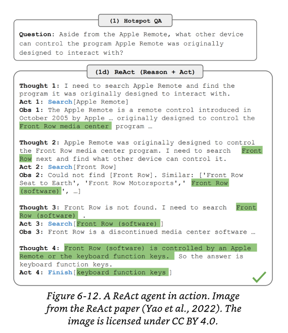

How do you count how many tokens are in a text file?

---

How do you evaluate your embedding model?

---

https://www.pinecone.io/learn/chunking-strategies/

---

https://research.trychroma.com/evaluating-chunking

---

https://platform.openai.com/docs/guides/prompt-engineering

---

Reflection and error correction isn't strictly necessary for an agent to operate. But it is necessary for an agent to succeed.

You can use reflection in many different places:

- After receiving a user query to evaluate if the request is feasible.
- After the initial plan generation to evaluate whether the plan makes sense.
- After each execution step to evaluate if it's on the right track.
- And after the whole plan has been executed to determine if the plan has been completed.

---

Interleaving reasoning and action has become a common pattern for agents. This was first proposed in the ReAct paper.

https://arxiv.org/abs/2210.03629

---

Here's a really good example of ReAct: Reasoning and action working together.

The key format is to have three different outputs of each step:

1. Thought: The reasoning behind the action
2. Act: The action itself
3. Observation: The result of the action

---

Reflexion:

In Reflexion, you have two modules:

1. An evaluator that evaluates the outcome
2. A self-reflection module that analyzes what went wrong.

Reference: https://arxiv.org/abs/2303.11366

[An example of Reflexion in action]

---

The downside of both ReAct and Reflexion is that thoughts, observations, and actions can take a lot of tokens to generate.

This increases cost and user-perceived latency.

To get their agents to follow the format, both ReAct and Reflexion authors used plenty of examples in their prompts.

---

There's no foolproof guide on how to select the best set of tools for your agent. Chameleon uses thirteen tools, Guerrilla uses one thousand six hundred and forty-five tools.

---

There's no foolproof guide on how to select the best set of tools for your agent. Chameleon uses thirteen tools, Gorilla uses one thousand six hundred and forty-five tools.

[Chameleon](https://arxiv.org/abs/2304.09842)
[Gorilla](https://arxiv.org/abs/2305.15334)

---

The more tools there are, the harder it is for LLMs to efficiently use them.

It's hard for humans to master a large set of tools.

Giving agents a set of primitives which they can compose into larger tools is really key.

---

To understand how to evaluate an agent, you need to understand its failure modes. The more complex a task that the agent performs, the more failure modes there are.

Agents have unique failures caused by planning, tool execution, and efficiency.

Agents may fail to plan properly. They might generate a plan with several errors. There might be invalid tool use: they might call a valid tool, but call invalid parameters. It might call valid parameters, but pass incorrect values to those parameters.

---

Agents might simply fail to achieve their goal. Imagine you ask an agent to plan a holiday. It might:

- Forget to book you a hotel
- Forget to organize flights
- Organize flights from the wrong location

An agent may also fail to follow constraints properly. If the trip should:

- Cost no more than $5,000, it might book a trip that costs $10,000
- Last no more than a week, it might book a trip that lasts two weeks

---

To evaluate an agent for planning failures, you can create a planning data set where each example is a tuple of task and tool inventory.

You can then compute the following metrics:

- Checking how many of the generated plans are valid
- How many plans did the agent have to generate to get a valid plan
- Out of the tool calls generated, how many of them are valid
- How often are invalid tools called with invalid parameters

You can then analyze the agent's outputs for patterns. What tools did the model frequently make mistakes with? Some tools might be harder for an agent to use.

---

A question I have is whether you use a planner that has access to only hypothetical tools.

It would generate a natural language output which could then be evaluated on its own merits.

Then you could pass that into a translation module which would run the actual tool calls and execute the plan.

I wonder whether this would circumvent some of the issues that folks report when passing LLMs a too-large tool inventory.

---

When you're evaluating your agents, you also need to evaluate efficiency—how efficient is the agent at the task.

Efficiency means lower cost and lower latency. But of course, efficiency is always on a separate axis to accuracy.

---

One thing that's interesting about AI agents is that they have different definitions of efficiency. For a human to check 100 web pages it's extremely inefficient. For an AI agent to check 100 web pages it's very very efficient because it can parallelize it.

---

What is the difference between generative AI and predictive AI? This is something I need to look further into.
